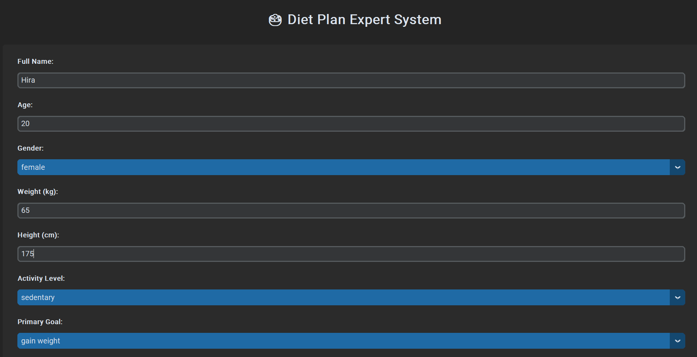
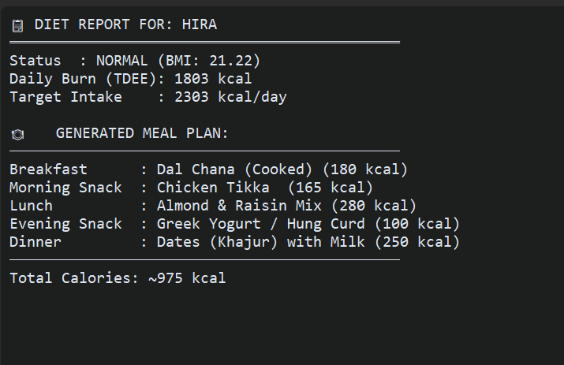

# 🥗 Diet Plan Expert System

## Overview

The Diet Plan Expert System is an AI-based rule-driven application that generates personalized diet recommendations based on a user's health profile, fitness goals, and medical conditions.

The system uses a Knowledge Base and a Forward Chaining Inference Engine to analyze user information and generate suitable meal plans.

---

## Features

* Calculate Body Mass Index (BMI)
* Classify BMI category
* Calculate Total Daily Energy Expenditure (TDEE)
* Generate personalized calorie targets
* Recommend suitable food categories
* Suggest meal plans automatically
* Support multiple health conditions
* User-friendly graphical interface using CustomTkinter

---

## Expert System Components

### Knowledge Base

The knowledge base stores:

* BMI categories
* Food database
* Disease restrictions
* IF–THEN rules
* Valid user inputs

### Inference Engine

The inference engine uses Forward Chaining to:

* Analyze user goals
* Evaluate medical conditions
* Apply expert rules
* Generate dietary recommendations

### Rule Examples

IF Goal = Lose Weight
THEN Reduce Calories and Recommend Low-Calorie Foods

IF Disease = Diabetes
THEN Recommend Low-Sugar Foods and Avoid Sugary Foods

IF Disease = Hypertension
THEN Recommend Low-Sodium Foods and Avoid Salty Foods

---

## Technologies Used

* Python
* CustomTkinter
* Rule-Based Expert Systems
* Forward Chaining
* Knowledge-Based Systems

---

## How It Works

1. User enters personal information.
2. BMI is calculated.
3. TDEE is calculated.
4. Forward Chaining rules are applied.
5. Suitable food categories are selected.
6. A personalized meal plan is generated.

## Sample Inputs

* Age: 25
* Gender: Female
* Weight: 65 kg
* Height: 165 cm
* Activity Level: Moderate
* Goal: Lose Weight
* Condition: Diabetes

## Screenshots

### User Input Interface

### Generated Diet Plan

## Future Enhancements

* More diseases and medical conditions
* Expanded food database
* Nutritional analysis charts
* Database integration
* Machine learning-based recommendations

